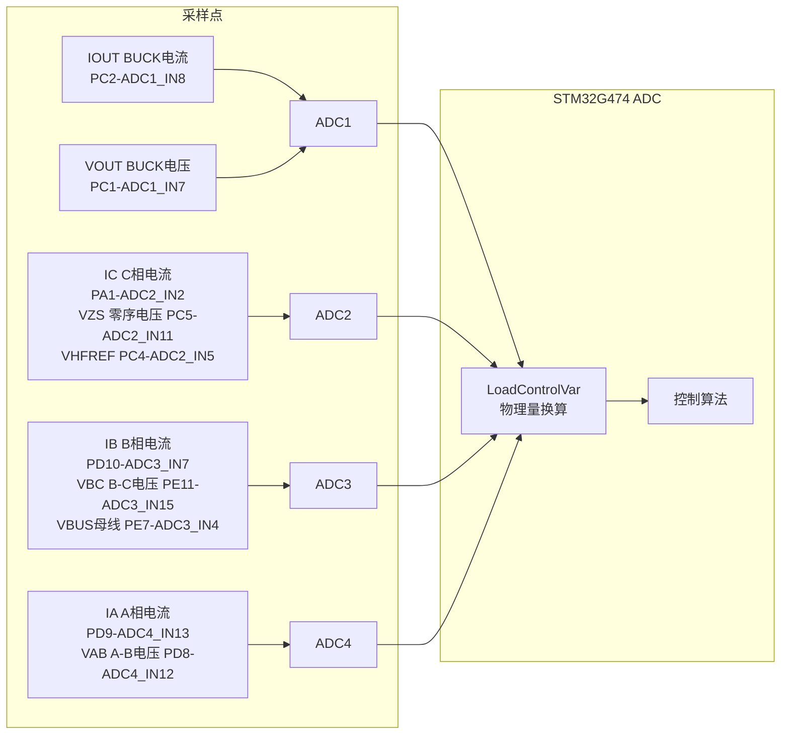
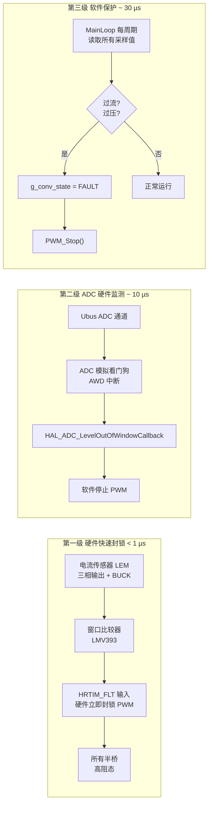

# 三相 AC-DC 变换电路 — 嵌入式固件

> **2021 年全国大学生电子设计竞赛（TI 杯）本科组 B 题**
>
> 基于 STM32G474VCT6 的三相 AC-DC 变换电路数字控制系统

---

## 目录

- [项目概述](#项目概述)
- [题目简介](#题目简介)
- [做题流程](#做题流程)
- [系统架构](#系统架构)
- [固件架构](#固件架构)
- [硬件平台](#硬件平台)
- [硬件设计](#硬件设计)
- [项目结构](#项目结构)
- [快速开始](#快速开始)
- [关键模块说明](#关键模块说明)
- [测试结果](#测试结果)
- [当前状态](#当前状态)
- [许可证](#许可证)

---

## 项目概述

本项目实现了 **2021 年全国大学生电子设计竞赛 B 题——三相 AC-DC 变换电路** 的完整嵌入式控制系统。

系统以 **STM32G474VCT6** 为主控芯片，采用 **三相两电平 PWM 电压型整流器（VSR）+ 一路 BUCK 降压** 拓扑，共 4 个半桥并联，配合高分辨率定时器（HRTIM）、多通道 ADC 同步采样等片上资源，实现：

- **直流输出稳压**：$U_o = 36\,\text{V} \pm 0.1\,\text{V}$
- **负载调整率**：$S_I \leq 0.3\%$（$I_o = 0.1\,\text{A} \sim 2.0\,\text{A}$）
- **电压调整率**：$S_U \leq 0.3\%$（$U_i = 23\,\text{V} \sim 33\,\text{V}$）
- **高效率**：$\eta \geq 85\%$（基本）/ $\eta \geq 95\%$（发挥）
- **高功率因数**：$\text{PF} \geq 0.99$，且可数字设定（$0.90 \sim 1.00$）

详细题目要求见 [`Docs/B_三相AC-DC变换电路.pdf`](../Docs/B_三相AC-DC变换电路.pdf)。

---

## 题目简介

2021 年 TI 杯全国大学生电子设计竞赛 **B 题——三相 AC-DC 变换电路**，要求设计并制作一个将三相交流电转换为稳定直流输出的变换电路。

> **题目原文**：[`Docs/B_三相AC-DC变换电路.pdf`](../Docs/B_三相AC-DC变换电路.pdf)

<!-- ====== 题目图片占位符 ====== -->

| 图片 | 说明 |
|:---:|------|
| <!-- TODO: 插入题目系统框图 --> | **图 1‑1 题目系统框图** — 三相交流输入 → 三相变压器 → 三相 AC-DC 变换电路 → 直流输出 $(U_o=36\,\text{V}, I_o=2\,\text{A})$ |
| <!-- TODO: 插入题目基本要求表格截图 --> | **图 1‑2 基本要求** — 输出电压精度、负载调整率、电压调整率、效率指标 |
| <!-- TODO: 插入题目发挥部分表格截图 --> | **图 1‑3 发挥部分** — 功率因数、效率、可调 PF、创新加分 |

### 基本要求

| 项目 | 条件 | 指标 |
|:---:|------|------|
| 输出电压 | $U_i = 28\,\text{V}$, $I_o = 2\,\text{A}$ | $U_o = 36\,\text{V} \pm 0.1\,\text{V}$ |
| 负载调整率 | $U_i = 28\,\text{V}$, $I_o$ 在 $0.1 \sim 2.0\,\text{A}$ 变化 | $S_I \leq 0.3\%$ |
| 电压调整率 | $I_o = 2\,\text{A}$, $U_i$ 在 $23 \sim 33\,\text{V}$ 变化 | $S_U \leq 0.3\%$ |
| 效率 | $U_i = 28\,\text{V}$, $I_o = 2\,\text{A}$, $U_o = 36\,\text{V}$ | $\eta \geq 85\%$ |

### 发挥部分

| 项目 | 条件 | 指标 |
|:---:|------|------|
| 功率因数 | $U_i = 28\,\text{V}$, $I_o = 2\,\text{A}$, $U_o = 36\,\text{V}$ | $\text{PF} \geq 0.99$ |
| 效率 | $U_i = 28\,\text{V}$, $I_o = 2\,\text{A}$, $U_o = 36\,\text{V}$ | $\eta \geq 95\%$ |
| 功率因数可调 | 数字设定 | $0.90 \sim 1.00$，误差 $\leq 0.02$ |
| 创新 | 自主设计加分项 | — |

---

## 做题流程

本文档记录了解题的核心思路与工程流程，供后续调试与复现参考。


### 1. 题目要求分析

- 稳定输出 **36 V**，精度 $\pm 0.1\,\text{V}$（0.28%）
- 输入线电压 **23~33 V**，输出电流 **0.1~2.0 A** 宽范围
- 效率 **≥ 85%**（基本）/ **≥ 95%**（发挥）
- 功率因数 **≥ 0.99**，且可数字设定 $0.90 \sim 1.00$
- 须计入辅助电源功耗
- 过流/过压/短路保护

### 2. 拓扑分析与选型

| 拓扑方案 | 优点 | 缺点 | 选择 |
|---------|------|------|:---:|
| 三相维也纳整流 (Vienna) | 3 管、无桥臂直通 | ① 整流二极管导通压降在 $<50\,\text{V}$ 低压输出时损耗占比极大，严重拉低效率 ② 母线电压需高于输入线电压峰值（$>\sqrt{2}\cdot 33\,\text{V} \approx 46.7\,\text{V}$），过高母线电压增加 BUCK 级开关损耗 | |
| 三相两电平 PWM 整流器 (VSR) | 结构简洁、控制成熟、每相独立、低电压效率高 | 有直通风险和 EMI 问题较大 | ⭐ |

**本方案**：采用 **三相两电平 PWM 电压型整流器（VSR）+ 一路 BUCK 降压** 拓扑。三相整流器负责 AC-DC 变换与 PFC，BUCK 级将不稳定的母线电压稳压至 36 V 输出。

**为什么不是两级（整流+逆变）而是整流+BUCK？**

- B 题只需单向 AC→DC 变换，无需逆变回馈
- BUCK 降压级比逆变级更适合宽范围输出稳压
- 采用 **4 个半桥并联** 的方案：三相整流器占用 3 个半桥（HRTIM A/B/C），BUCK 占用 1 个半桥（HRTIM D），共用同一组 HRTIM1 定时器资源，简化硬件布局

### 3. 采样点确定与 ADC 分配



| 物理信号 | GPIO | ADCx_INx | DMA 索引 | 用途 |
|---------|:----:|:--------:|:--------:|------|
| $I_{L}$ — BUCK 电感电流 | PC2 | ADC1_IN8 | 0 | BUCK 电流内环反馈，由 ADC4 EOS 触发环路函数 |
| $V_{OUT}$ — BUCK 输出电压 | PC1 | ADC1_IN7 | 1 | BUCK 电压外环反馈 |
| $I_C$ — C 相电流 | PA1 | ADC2_IN2 | 0 | 三相电流 PR 环反馈 |
| $V_{ZS}$ — 零序电压 | PC5 | ADC2_IN11 | 1 | SVPWM 零序注入 / 三相平衡监测 |
| $V_{HFREF}$ — 半母线参考 | PC4 | ADC2_IN5 | 2 | 辅助参考 |
| $I_B$ — B 相电流 | PD10 | ADC3_IN7 | 0 | 三相电流 PR 环反馈 |
| $V_{BC}$ — B-C 线电压 | PE11 | ADC3_IN15 | 1 | 输入电压前馈 + 构造参考电流波形 |
| $V_{BUS}$ — 直流母线电压 | PE7 | ADC3_IN4 | 2 | 电压外环反馈 + 过压保护 |
| $I_A$ — A 相电流 | PD9 | ADC4_IN13 | 0 | 三相电流 PR 环反馈 |
| $V_{AB}$ — A-B 线电压 | PD8 | ADC4_IN12 | 1 | 输入电压前馈 + 构造参考电流波形 |

**ADC 硬件配置要点**：

- **HRTIM 触发链**：各 ADC 由对应 HRTIM 定时器的比较事件硬件触发，实现全自动同步采样：

| ADC | HRTIM 定时器 | 触发事件 | HRTIM ADC Trigger | 说明 |
|:---:|:-----------:|---------|:-----------------:|------|
| ADC1 | Timer D (BUCK) | CMP3 | ADCTRIG_1 | BUCK 电流/电压采样，EOS ISR 调用 `MainLoop()` |
| ADC2 | Timer B (整流 B) | CMP3 | ADCTRIG_3 | IC、VZS、VHFREF 采样 |
| ADC3 | Timer C (整流 C) | CMP4 | ADCTRIG_5 | IB、VBC、VBUS 采样 |
| ADC4 | Timer A (整流 A) | CMP4 | ADCTRIG_4 | IA、VAB 采样 |

- **采样顺序**：ADC4（Timer A）→ ADC2（Timer B）→ ADC3（Timer C）→ ADC1（Timer D）随各自定时器时序依次触发
- **循环 DMA 模式**，缓冲区内数据自动更新无需 CPU 干预
- 使用 `LoadControlVar()` 在 ADC4 的 EOS 中断（或 HRTIM 中断）中完成原始值 → 物理量换算（斜率 + 零偏）
- **电压有效值计算**：使用与 PF 移相**共用**的环形队列缓冲区（循环数组），对 $U_a, U_b$ 做递推滑动窗口 RMS。每采样一个新点 $x[k]$，压入队列同时弹出最旧值 $x[k-N]$：
  $$
  \Sigma \gets \Sigma + x^2[k] - x^2[k-N], \quad U_{rms} = \sqrt{\frac{\Sigma}{N}}
  $$
  队列深度 $N$ 可取半周波点数（如 166 点 @30 kHz / 50 Hz），RMS 更新仅需 1 次乘加和 1 次减法，计算量恒定。
- **归一化**：$U_{x\_norm} = U_x / U_{rms}$，得到幅值为 1 的单位正弦波。
- **PF 延迟**：同一环形队列的读取指针偏移即可实现移相，无需额外存储。
- **VREF**：使用 **REF3033** 提供精确 $3.300\,\text{V}$ 基准，ADC 参考电压硬编码为 $V_{ref+} = 3.3\,\text{V}$，无需 VREFINT 校准。

### 4. 控制策略设计

#### 整体控制架构

```
                    ┌─────────────────────────────────────┐
                    │         电压外环 (PI)                 │
                    │  Ubus_ref ──→ PI ──→ Idc_ref        │
                    │  (母线电压→直流参考电流幅值)          │
                    └────────────────┬────────────────────┘
                                     │ Idc_ref (直流)
                                     ▼
                    ┌─────────────────────────────────────┐
                    │      参考电流波形合成                  │
                    │  ① 采样 Uab, Ubc → 重构 Ua, Ub, Uc  │
                    │  ② 有效值归一化: Ux_norm = Ux/Urms   │
                    │  ③ 合成参考电流(可选PF移相):          │
                    │  Iref_a = Idc_ref × Ua_norm          │
                    │  Iref_b = Idc_ref × Ub_norm          │
                    │  (Ic 由 -Ia - Ib 导出)               │
                    │                                      │
                    │  PF=1: 不移相  PF≠1: 数组延迟移相    │
                    └──────────────┬──────────────────────┘
                                     │ Iref_a, Iref_b (正弦)
                                     ▼
                    ┌─────────────────────────────────────┐
                    │     双 PR 电流内环 (A/B 相, 120°)     │
                    │                                      │
                    │  Iref_a ─→ [PR_a] ─→ Va_ref         │
                    │  Iref_b ─→ [PR_b] ─→ Vb_ref         │
                    │                                      │
                    │  C 相: Vc_ref = -Va_ref - Vb_ref     │
                    │  零序注入 → SVPWM/DPWM-A             │
                    │  → HRTIM A/B/C                       │
                    └─────────────────────────────────────┘

                    ┌─────────────────────────────────────┐
                    │        BUCK 控制                      │
                    │  Uo_ref ──→ PI电压环 ──→ Iref        │
                    │  Iref ──→ P电流环 ──→ Duty ──→ HRTIM D│
                    └─────────────────────────────────────┘
```

#### 三相整流器控制——电压外环 + 参考电流 + 双 PR 电流内环

**核心思想**：不使用 $dq$ 旋转坐标系（无需 Park 变换 + 锁相环 PLL），而是在 **ABC 静止坐标系** 中使用 **双 PR（比例谐振）控制器** 直接控制 A、B 两相电流（二者天然相差 120°），C 相由 $-A-B$ 导出。

**1. 电压外环 (PI)**

- 给定：`Ubus_ref`（直流母线电压目标值）
- 反馈：`Ubus`（ADC 采样）
- 输出：**`Idc_ref`** — 直流参考电流幅值（非正弦量），经限幅后送入参考电流合成
- 作用：母线电压误差经 PI 调节得到一个直流电流幅值 `Idc_ref`，它乘以单位化的输入电压波形即得到正弦参考电流的幅值。负载越重 → `Idc_ref` 越大 → 输入电流幅值越大。

**2. 参考电流波形合成（关键步骤）**

这是将电压外环输出的 **直流 `Idc_ref`** 转换为 **正弦参考电流 `Iref_a, Iref_b`** 的核心环节：

```
Idc_ref (直流)                    Uab, Ubc (ADC 采样)
      │                                │
      │                                ▼
      │                    重构三相电压 Ua, Ub, Uc
      │                          │
      │                          ▼
      │                   有效值计算 Urms ← 滑动窗口 / 单周期
      │                          │
      │                          ▼
      │                    归一化 Ux_norm = Ux / Urms
      │                          │
      │                    ┌─────┴─────┐
      │                    │ PF=1?     │
      │                    ├──是──┬──否──┤
      │                    │      │      │
      │                    ▼      ▼      │
      │              不移相   数组延迟移相 │
      │                    │      │      │
      │                    └──┬───┘      │
      │                       ▼          │
      │              Ua_norm_delayed      │
      │              Ub_norm_delayed      │
      └───────────┬───────────┘
                  │
                  ▼
     Iref_a = Idc_ref × Ua_norm(或延迟后)
     Iref_b = Idc_ref × Ub_norm(或延迟后)
     Iref_c = -(Iref_a + Iref_b)  ← 导出
```

- **有效值计算**：对采样到的 $U_a, U_b$ 做滑动窗口 RMS 计算（如半周波或单周期窗口），用于归一化：
  $$
  U_{rms} = \sqrt{\frac{1}{N}\sum_{k=0}^{N-1} u^2[k]}
  $$
  归一化后的 $U_x\_norm$ 是幅值为 1 的单位正弦波，乘以 `Idc_ref` 即得到幅值正比于负载的正弦参考电流。

- **单位功率因数（PF = 1.0）**：`Idc_ref` 直接乘以未移相的单位化电压波形，参考电流与输入电压同相同形。

- **功率因数可调（PF ≠ 1.0）**：通过 **数组延迟** 实现对电压波形的移相。将采样到的 $U_a\_norm, U_b\_norm$ 存入循环缓冲区，读取时按设定的延迟点数偏移，等效于移相 $\phi$：
  $$
  \text{延迟点数} = \frac{\phi}{360°} \times \frac{f_{sw}}{f_{grid}}
  $$
  移相后的单位化电压波形再与 `Idc_ref` 相乘，即得到所需 PF 的正弦参考电流。

**3. 双 PR 电流内环（A/B 相, 120° 静止坐标系）**

- 两个 PR 控制器分别控制 **A 相** 和 **B 相** 电流（二者相差 120°）
- C 相不设独立控制器，由 $V_{c\_ref} = -V_{a\_ref} - V_{b\_ref}$ 导出
- PR 传递函数（准 PR）：
  $$
  G_{PR}(s) = K_p + \frac{2K_r \omega_c s}{s^2 + 2\omega_c s + \omega_0^2}
  $$
- PR 在基波频率 $\omega_0 = 2\pi \times 50\,\text{Hz}$ 处增益极大，实现正弦无静差跟踪
- 准 PR（$\omega_c > 0$）增加带宽，对电网频率波动有鲁棒性
- PR 输出 $V_{a\_ref}, V_{b\_ref}$ 经零序注入后送入 SVPWM / DPWM

**⚠️ 控制器限幅与抗饱和（关键）**

所有 PI/PR 控制器必须配备 **输出限幅** 和 **积分/谐振项抗饱和**，否则在开环调试或启动瞬间积分/谐振项会无限累积，导致环路崩溃：

| 控制器 | 限幅参数 | 抗饱和策略 | 限幅依据 |
|--------|---------|-----------|---------|
| 电压外环 PI | `Idc_ref` 限幅 $[0, I_{max}]$ | 积分分离：`Ubus` 偏差过大时冻结积分 | $I_{max}$ 由硬件电流传感器量程和功率管额定电流决定 |
| PR 电流内环 | `Va_ref` / `Vb_ref` 限幅 $[\pm V_{dc}/2]$ | **反计算抗饱和**（见 `algorithm_control.c` `PR_Control()`）：输出饱和时将限幅差值反算回误差项，避免谐振项无限累积，基于香港理工大学论文《用于逆变器的比例-谐振控制器的抗饱和方案》| 调制比上限 $\pm V_{dc}/2$ 对应 SVPWM 线性区边界 |
| BUCK 电压 PI | `Ibuck_ref` 限幅 $[0, I_{buck\_max}]$ | 积分分离 | $I_{buck\_max}$ 由 BUCK 电感饱和电流和输出电容决定 |
| BUCK 电流 P | `Duty` 限幅 $[D_{min}, D_{max}]$ | 纯比例无需饱和处理 | $D_{max}$ 由 HRTIM 死区和最小导通时间决定 |

限幅值需与硬件参数匹配，在 `conv_controller.h` 中通过宏定义集中配置，便于调试时调整。

**4. SVPWM / DPWM-A 调制**

- 整流侧三相使用 **SVPWM** 调制（标准 7 段式），零序分量 min-max 注入
- **DPWM-A**（待实现）：不连续 PWM 变体，每相在 60° 区间内钳位到母线轨，此区间内该相不开关，可降低开关损耗约 1/3。根据电流相位实时切换钳位区间。

#### BUCK 降压控制——PI 电压环 + P 电流环

- **电压外环 (PI)**：给定 36 V，反馈 $U_{buck}$，输出电流参考 $I_{buck\_ref}$
- **电流内环 (P)**：跟踪 $I_{buck\_ref}$，输出占空比
- 电流内环使用纯比例（P）控制即可，无需积分项
- BUCK 开关频率由 HRTIM D 独立配置，通常高于整流侧

#### 4.5 保护系统设计

保护系统采用 **三级硬件+软件协同** 架构，确保任何故障都能在最短时间内响应：



| 层级 | 保护对象 | 传感器/检测 | 执行器 | 响应时间 | 动作 |
|:---:|---------|------------|--------|:-------:|------|
| **1 — 硬件快速封锁** | 三相电流、BUCK 电流 | 电流传感器（LEM/采样电阻）→ **外部窗口比较器** → HRTIM1 故障输入引脚 `FLT` | HRTIM 硬件 | **< 1 µs** | 立即将所有 PWM 输出置为高阻态（三态），不受软件干预 |
| **2 — ADC 看门狗** | 直流母线电压 $U_{bus}$ | ADC3 通道 → 配置 ADC 模拟看门狗（AWD），设置上下阈值 | ADC 中断回调 | **~ 10 µs** | 触发 `HAL_ADC_LevelOutOfWindowCallback()` → 软件置 `CONV_FAULT` → `PWM_Stop()` |
| **3 — 软件过流检测** | 全部 9 路采样 | `MainLoop()` 中每周期调用 `Protection()` 函数 | 软件状态机 | **~ 30 µs** | 比较各通道采样值与阈值 → 超限则 `g_conv_state = CONV_FAULT` → `PWM_Stop()` → 弹窗通知 + 自动恢复尝试 |

**保护阈值配置**（在 `conv_protection.h` 中定义）：

```c
#define PROT_OVERCURRENT_LIMIT    5.0f   // 过流阈值 (A)
#define PROT_OVERVOLTAGE_LIMIT    60.0f  // 过压阈值 (V)
#define PROT_AUTO_RETRY_ENABLE    1      // 是否启用自动恢复
#define PROT_AUTO_RETRY_DELAY_MS  2000   // 故障后等待重试时间 (ms)
#define PROT_AUTO_RETRY_MAX       3      // 最大重试次数
```

**自动恢复机制**：`AutoRecover_Task()` 以可配置延迟（默认 2 s）自动将 `g_conv_state` 从 `CONV_FAULT` 复位到 `CONV_STOP`，再由用户通过仪表盘重新启动。连续失败超过 `PROT_AUTO_RETRY_MAX` 次则永久闭锁，需硬件复位。

#### 待实现的高级功能

| 功能 | 说明 |
|:----|------|
| **DPWM-A** | 不连续 PWM 变体，每相 60° 钳位到母线轨，降低开关损耗约 1/3；需根据电流相位实时切换钳位区间 |
| **自适应母线电压** | $V_{bus\_ref} = \max(V_{out},\ \sqrt{2} \cdot V_{in\_rms})$ — 取 BUCK 所需最低输入电压（$V_{out}$）与整流器 Boost 所需最低母线电压（$\sqrt{2}V_{in\_rms}$）中的较大者，在保证正常工作的前提下最小化母线电压以降低开关损耗 |
| **自适应死区** | 根据负载电流大小动态调整 HRTIM 死区时间：轻载小死区（减小波形失真），重载大死区（防止直通） |

### 5. 软件架构设计

- **三优先级架构**：
  - **HRTIM 重复中断（最高）**：开关频率 **30 kHz 固定**，执行 PR 电流环、BUCK 电流环、PWM 更新
  - **HRTIM 中慢速路径（中等）**：有效值计算、电压归一化、PF 移相（每若干开关周期执行一次）
  - **FreeRTOS 任务（最低）**：UI 显示、按键扫描、电源管理、系统统计
- **7 个 RTOS 任务**：见[固件架构](#固件架构)
- **保护分层**：
  1. **ADC 看门狗** — 硬件监测 $U_{bus}$，超阈值即触发中断
  2. **外部窗口比较器 + HRTIM_FLT** — 电流传感器输出接入窗口比较器，超限立即硬件封锁 HRTIM 所有 PWM 输出
  3. **软件过流检测** — `MainLoop()` 中每周期比较采样值，超限则软件停止 PWM

### 6. 硬件电路设计

见 [硬件设计](#硬件设计) 章节。

### 7. 调试与验证

见 [测试结果](#测试结果) 章节。

---

## 系统架构

```
三相交流输入 (Ainuo 15 kW 可编程三相交流源, Ui = 23~33 V)
        │
        ▼
┌───────────────────────────────────────────────────────┐
│                三相 AC-DC 变换电路                      │
│                                                        │
│  ┌──────────────────────────┐  ┌──────────────────┐   │
│  │  三相两电平 PWM 整流器     │  │  BUCK 降压级      │   │
│  │  (3 个半桥并联, HRTIM A-C) │→│  (1 个半桥,       │   │
│  │   三相交流 → 直流母线      │  │   HRTIM D)        │   │
│  │   + PFC + 升压            │  │   母线电压 → 36V  │   │
│  └──────────────────────────┘  └──────────────────┘   │
│                                                        │
│  ┌─ 采样: Ia, Ib, Ic ─────────────────────────────┐   │
│  │  Uab, Ubc, Uz, Ubus, Ibuck, Ubuck              │   │
│  └────────────────────────────────────────────────┘   │
│                                                        │
│  ┌─ HRTIM1 资源分配 ───────────────────────────────┐  │
│  │  Timer A: 整流 A 相 (TA2=AH, TA1=AL)            │   │
│  │  Timer B: 整流 B 相 (TB2=BH, TB1=BL)            │   │
│  │  Timer C: 整流 C 相 (TC2=CH, TC1=CL)            │   │
│  │  Timer D: BUCK 半桥 (TD2=NH, TD1=NL)            │   │
│  │  PWM EN → GPIO 3V4                              │   │
│  │  OC 保护 → HRTIM FLT1                           │   │
│  │  ADC 触发: TA CMP4→ADC4 / TB CMP3→ADC2         │   │
│  │            TC CMP4→ADC3 / TD CMP3→ADC1→EOS→Main │   │
│  └────────────────────────────────────────────────┘   │
└──────────────────────────┬────────────────────────────┘
                           │
                           ▼
                  直流输出 Uo = 36 V
                    Io = 0.1~2.0 A
```

系统采用 **三相两电平 PWM 电压型整流器（VSR）+ 一路 BUCK 降压** 的级联结构：

- **前级 — 三相两电平 PWM 整流器**：3 个半桥（HRTIM A/B/C），将三相交流电整流为直流母线电压，同时实现 PFC（功率因数校正）。控制策略为电压外环 PI 输出直流电流幅值 `Idc_ref`，与采样输入电压经有效值归一化后的单位波形相乘，构造正弦参考电流，再送入双 PR 电流内环（仅控制 A/B 两相，C 相由 $-A-B$ 导出）。无需 $dq$ 旋转坐标系和锁相环（PLL）。
- **后级 — BUCK 降压变换器**：1 个半桥（HRTIM D），将不稳定的直流母线电压降压至 36 V 稳定输出。控制策略为 PI 电压环 + P 电流环。
- **共 4 个半桥**，全部由 **HRTIM1** 驱动。PWM 引脚分配：TA2=AH / TA1=AL（整流 A），TB2=BH / TB1=BL（整流 B），TC2=CH / TC1=CL（整流 C），TD2=NH / TD1=NL（BUCK）。PW EN 由 GPIO 3V4 控制，过流保护接入 HRTIM FLT1。
- **ADC 触发**：TA CMP4→ADC4（IA/VAB），TB CMP3→ADC2（IC/VZS/VHFREF），TC CMP4→ADC3（IB/VBC/VBUS），TD CMP3→ADC1（IOUT/VOUT），ADC4 EOS 中断调用 `MainLoop()`。
- **功率因数调节**：通过数组延迟输入电压波形实现移相，延迟后的单位化电压与 `Idc_ref` 相乘即得到所需 PF 的正弦参考电流。

---

## 固件架构

### 软件分层

```
┌──────────────────────────────────────────────────────────┐
│                   应用层 (Applications)                    │
│  Dashboard · Burn-in Test · I2C Scanner · Snake · Dino   │
├──────────────────────────────────────────────────────────┤
│                   框架服务层 (Framework)                   │
│  电源管理 · 系统操作 · 系统统计 · RTC时间 · 蜂鸣器 · 通知 │
├──────────────────────────────────────────────────────────┤
│                   电源控制层 (PowerControl)                │
│  ADC采样 → 控制器(PR/PI/P) → 环路算法 → PWM驱动 → 保护   │
├──────────────────────────────────────────────────────────┤
│                   UI 框架层 (MiaoUI + u8g2)               │
│  图标菜单 · 列表菜单 · 动画引擎 · 显示驱动 · 输入驱动     │
├──────────────────────────────────────────────────────────┤
│                  BSP + HAL + CMSIS-RTOS 层                │
│  HRTIM · ADC1~4 · SPI · I2C · UART · RTC · COMP  │
└──────────────────────────────────────────────────────────┘
```

### FreeRTOS 任务

| 任务名 | 优先级 | 栈大小 | 功能 |
|--------|--------|--------|------|
| `powerdown_Task` | Realtime | 128 | 电源管理主状态机，休眠/唤醒控制 |
| `UI` | Low | 512 | OLED 显示与 MiaoUI 事件循环 (40 fps) |
| `Button` | High | 96 | 按键扫描与去抖 (10 ms) |
| `Beep` | Low | 64 | PWM 蜂鸣器驱动 |
| `Notification` | Normal | 128 | OLED 弹窗通知管理 |
| `AutoRecover` | Low | 64 | 故障自动恢复重试 |
| `Update` | Low | 256 | 系统参数采集（结温、电池电压、内部参考） |

### 实时控制路径

```
HRTIM 触发链 (开关频率 30 kHz)
    │
    ├── Timer A CMP4 ─→ ADCTRIG_4 ─→ ADC4  (IA, VAB)
    ├── Timer B CMP3 ─→ ADCTRIG_3 ─→ ADC2  (IC, VZS, VHFREF)
    ├── Timer C CMP4 ─→ ADCTRIG_5 ─→ ADC3  (IB, VBC, VBUS)
    └── Timer D CMP3 ─→ ADCTRIG_1 ─→ ADC1  (IOUT, VOUT)
                                          │
                                          └── EOS ISR
                                              │
                                              └── MainLoop()  [conv_controller.c]
                                                   │
                                                   ├── LoadControlVar() ← ADC DMA 缓冲  [conv_adc.c]
                                                   │    └── 10 路采样 → float 物理量
                                                   │
                                                   ├── [整流器慢速路径 — 非实时更新]
         │    ├── 有效值计算 (滑动窗口)
         │    ├── 单位化: Ux_norm = Ux / Urms
         │    └── (可选) PF 移相: 数组延迟电压波形
         │
         ├── [CONV_RUN 状态 — 实时路径 30 kHz]
         │    │
         │    ├── 整流器控制路径:
         │    │   ├── 电压外环 PI (Ubus_ref - Ubus) → Idc_ref
         │    │   ├── 参考电流合成:
         │    │   │   Iref_a = Idc_ref × Ua_norm(或延迟)
         │    │   │   Iref_b = Idc_ref × Ub_norm(或延迟)
         │    │   │   Iref_c = -Iref_a - Iref_b
         │    │   ├── PR_a(Iref_a - Ia) → Va_ref
         │    │   ├── PR_b(Iref_b - Ib) → Vb_ref
         │    │   ├── Vc_ref = -Va_ref - Vb_ref
         │    │   ├── 零序注入 (min-max)
         │    │   └── SVPWM / DPWM-A → SetDuty_Rec() → HRTIM A/B/C
         │    │
         │    ├── BUCK 控制路径:
         │    │   ├── PI 电压环 (Uo_ref - Ubuck) → Ibuck_ref
         │    │   ├── P 电流环 (Ibuck_ref - Ibuck) → Duty
         │    │   └── SetDuty_Buck() → HRTIM D
         │    │
         │    └── Protection() ← 过流/过压检测  [conv_protection.c]
         │
         └── 自适应算法 (慢速更新 loop):
              ├── 自适应母线电压: Vbus_ref = max(36V, √2·Vin_rms)
              ├── 自适应死区: 根据负载电流调整死区时间
              └── PF 移相延迟点数更新
```

### 任务间通信

- **3 个消息队列**：按键事件 (`Button_Queue`)、蜂鸣器指令 (`Beep_Queue`)、通知字符串 (`Notification_Queue`)
- **2 个互斥锁**：SPI 总线保护 (`mutex_gspi_`)、I2C 总线保护 (`mutex_i2c_`)

---

## 硬件平台

| 项目 | 规格 |
|------|------|
| **主控 MCU** | STM32G474VCT6 (Cortex-M4F @ 120 MHz，可超频至 240 MHz) |
| **PWM 定时器** | HRTIM1 (6 个定时器单元, 高分辨率 ~217 ps)，使用 A/B/C/D 四单元；TA2=AH/TA1=AL, TB2=BH/TB1=BL, TC2=CH/TC1=CL, TD2=NH/TD1=NL；PWM EN → GPIO 3V4, OC → FLT1 |
| **ADC** | 4 个独立 ADC (12-bit, 硬件触发同步采样, DMA 循环传输)；触发链: TA CMP4→ADC4, TB CMP3→ADC2, TC CMP4→ADC3, TD CMP3→ADC1→EOS→MainLoop |
| **硬件加速** | CCM SRAM (关键代码如 MainLoop 放入 CCM 以提高实时性) |
| **显示** | 1.3" OLED 128×64 (SH1106, SPI 4线) |
| **比较器** | 7 路模拟比较器 (过流硬件保护) |
| **通信** | FDCAN (1.25 Mbps)、USART/UART (带 DMA) |
| **调试** | 自制隔离 DAPLINK（SWD + UART4）|
| **开发工具** | Keil MDK (µVision), STM32CubeMX, LCEDA-Pro |

---

## 硬件设计

系统硬件由 **3 块 PCB + 1 个调试器** 组成，分别对应 3 个独立的 LCEDA-Pro 工程。这种模块化设计将控制逻辑、题目特定电路和功率级分离，便于调试和复用。

<!-- ====== 硬件图片占位符 ====== -->

| 图片 | 说明 |
|:---:|------|
| <!-- TODO: 插入系统硬件框图 --> | **图 3‑1 系统硬件框图** — 主控板 + 母板 + 驱动-功率一体模块 三板互联结构 |
| <!-- TODO: 插入主控板实物/渲染图 --> | **图 3‑2 主控板** — MCU、显示、通信、IO 保护 |
| <!-- TODO: 插入母板实物/渲染图 --> | **图 3‑3 母板** — 功率插座、辅助电源、电压采样 |
| <!-- TODO: 插入驱动-功率模块实物/渲染图 --> | **图 3‑4 驱动-功率一体模块** — 半桥驱动 + MOSFET + 电感 + 电流传感器 |
| <!-- TODO: 插入调试器实物/渲染图 --> | **图 3‑5 自制隔离 DAPLINK** — SWD + UART4 调试接口 |
| <!-- TODO: 插入整机装配照片 --> | **图 3‑6 整机装配图** — 三板堆叠/互联实物照片 |

---

### 3.1 项目工程结构

```
NUEDC_2021B/Hardware/
├── LCEDA_MainBoard/           ← 主控板工程
│   ├── MainBoard.sch          ← 原理图
│   └── MainBoard.pcb          ← PCB
├── LCEDA_MotherBoard/         ← 母板工程（题目专用）
│   ├── MotherBoard.sch
│   └── MotherBoard.pcb
├── LCEDA_PowerModule/         ← 驱动-功率一体模块工程
│   ├── PowerModule.sch
│   └── PowerModule.pcb
└── docs/                      ← 硬件设计文档（待补充）
    ├── pin_map.xlsx           ← 板间连接器引脚定义
    └── BOM/                   ← 物料清单
```

---

### 3.2 调试器 — 自制隔离 DAPLINK

| 项目 | 说明 |
|------|------|
| **型号** | 自制 DAPLINK（CMSIS-DAP 兼容）|
| **通信接口** | SWD（调试烧录）+ UART4（虚拟串口）|
| **隔离** | 数字隔离器隔离 SWD 和 UART 信号，确保调试时高压侧安全 |
| **目标连接器** | 10-pin Cortex-M SWD 排线 |

调试器通过 SWD 接口连接主控板 MCU 进行烧录和调试，同时 UART4 提供 printf 输出和交互式命令行。

---

### 3.3 主控板（Main Board）

> LCEDA-Pro 工程：`Hardware/LCEDA_MainBoard/`

主控板是系统的控制和交互核心，集成了 MCU、显示、通信和 IO 保护电路。

| 模块 | 器件/接口 | 说明 |
|------|----------|------|
| **MCU** | STM32G474VCT6 (LQFP100) | 主控芯片，120 MHz，Cortex-M4F |
| **电压基准** | REF3033 | 提供精确 3.300 V ADC 参考电压 |
| **显示** | 1.3" OLED 128×64, SH1106, SPI | 用户菜单和仪表盘显示 |
| **按键** | 独立按键 × N | 菜单导航和参数调节 |
| **RTC** | 外部 RTC 芯片（I2C） | 掉电保持时间 |
| **蓝牙** | 蓝牙模块（UART） | 无线调试/监控（可选）|
| **低压电源** | LDO / DC-DC | 为 MCU 和板上器件提供 3.3V / 5V |
| **EEPROM** | I2C EEPROM | 参数存储和校准数据保存 |
| **SPI FLASH** | SPI NOR Flash | 固件升级 / 数据记录 |
| **FDCAN** | FDCAN 收发器 | 与外部 CAN 总线通信 |
| **IO 保护** | 限流电阻 + TVS | 所有对外 GPIO 口均串接限流电阻并加 TVS 钳位，防误接/热插拔损坏 |

**对外接口（连接母板）：**

| 接口 | 信号 |
|------|------|
| HRTIM PWM × 8 路 | 4 对半桥互补 PWM（A/B/C/D）|
| ADC 输入 × 若干 | 母板电压/电流采样信号 |
| 按键/指示灯扩展 | GPIO |
| 电源 | 母板供电或独立供电 |

<!-- TODO: 插入主控板原理图/框图 -->

---

### 3.4 母板（Mother Board）

> LCEDA-Pro 工程：`Hardware/LCEDA_MotherBoard/`

母板是针对 2021 年 B 题设计的专用电路板，承载功率模块接口、辅助电源和电压采样电路。

| 模块 | 说明 |
|------|------|
| **功率模块插座** | 若干排针/排母插座，用于插接驱动-功率一体模块 |
| **功率模块电源** | 为各功率模块提供驱动级供电 |
| **母线-驱动辅助电源** | 从直流母线取电，经隔离 DC-DC 变换为驱动侧供电（如 +12V / -5V）|
| **电压采样** | 电阻分压网络 + 隔离运放，采样 A-B / B-C 线电压、零序电压、母线电压 |
| **转接口** | 排线/排针连接器，将主控板的 PWM/ADC/GPIO 信号路由到各功率模块插座 |

**板间连接：**
- 连接 **主控板**：PWM 输入、ADC 输出、电源、控制信号
- 连接 **驱动-功率模块**：通过插座提供 PWM（经驱动）、供电，并接收电流传感器信号

<!-- TODO: 插入母板原理图/框图 -->

---

### 3.5 驱动-功率半桥-电感-电感电流传感器一体模块（Power Module）

> LCEDA-Pro 工程：`Hardware/LCEDA_PowerModule/`

每个功率模块是一个完整的半桥单元，包含驱动、功率管、输出电感和电流检测。系统共使用 **4 个模块**（三相整流器 × 3 + BUCK × 1）。

| 器件 | 型号/规格 | 说明 |
|------|----------|------|
| **功率 MOSFET** | **Infineon BSC037N08NS5** | 80 V / 57 A / $R_{DS(on)} = 3.7\,\text{m}\Omega$，中低压 OptiMOS，适合 50 V 以下应用 |
| **栅极驱动** | 隔离型半桥驱动芯片 | 带死区设置和欠压锁定，为高侧提供自举供电 |
| **电感** | 功率电感（定制或标准） | 输出滤波电感，决定电流纹波 |
| **电感电流传感器** | 采样电阻 / 霍尔传感器 + 运放 | 检测电感电流，输出模拟信号至 ADC |

**模块化优势：**
- 每个半桥独立 PCB，可单独测试和更换
- 4 个模块完全一致（BUCK 模块与整流模块可共用设计，仅控制时序不同）
- 减少母板布线复杂度，功率回路与驱动回路在模块内部完成
<!-- TODO: 插入功率模块原理图/框图 -->

---

### 3.6 电气设计要点

| 项目 | 说明 |
|------|------|
| **功率器件** | BSC037N08NS5（80 V / 57 A / 3.7 mΩ），系统电压 ≤ 50 V，无需高压器件 |
| **半桥数量** | 4 个：三相整流器 × 3（HRTIM A/B/C）+ BUCK × 1（HRTIM D）|
| **开关频率** | 整流器 30 kHz，BUCK 30 kHz（固定）|
| **死区时间** | 初始值约 200 ns（`INITIAL_HRTIM_DEADTIME`），**待实现自适应死区** |
| **辅助电源** | 母线电压 → 隔离 DC-DC → 驱动供电；另有一路 LDO → 3.3 V 给 MCU |
| **散热** | MOSFET 安装散热片，强制风冷（效率 ≥ 95% 需精细热管理）|
| **保护** | 电流传感器 → 窗口比较器 → HRTIM_FLT 硬件快速封锁（< 1 µs）; ADC 看门狗保护母线过压 |
| **EMC** | 输入 LC 滤波 + Y 电容 + 共模扼流圈；布局分区（功率/驱动/控制隔离）|

---

## 项目结构

```
NUEDC_2021B/
├── Docs/                                ← 题目文档
│   └── B_三相AC-DC变换电路.pdf
├── Firmware_0/                          ← 固件主目录
│   ├── APP/
│   │   ├── adc_handle.c                 ← ADC 采集处理
│   │   ├── beep.c / beep.h              ← 蜂鸣器任务
│   │   ├── button_handle.c              ← 按键扫描任务
│   │   ├── ui_task.c                    ← UI 任务入口
│   │   ├── Applications/                ← 应用层
│   │   │   ├── application.h            ← 应用统一头文件（Hub）
│   │   │   ├── burn_in_tester.c/h       ← 烧屏测试
│   │   │   ├── game_dinosaur.c/h        ← 谷歌小恐龙游戏
│   │   │   ├── game_snake.c/h           ← 贪吃蛇游戏
│   │   │   └── i2c_scanner.c/h          ← I2C 设备扫描
│   │   ├── framework/                   ← 框架服务层
│   │   │   ├── app_event.h              ← 应用事件定义
│   │   │   ├── pm_api.h                 ← 电源管理 API
│   │   │   ├── pm_controller.c/h        ← 电源管理控制器
│   │   │   ├── pm_device.c/h            ← 外设电源管理钩子
│   │   │   ├── pm_device_builtin.c      ← 内置设备电源管理
│   │   │   ├── pm_policy.c/h            ← 电源策略决策
│   │   │   ├── pm_sleep_timer.c/h       ← 休眠定时器
│   │   │   ├── pm_ui_register.c/h       ← UI 电源注册
│   │   │   ├── powerdown_task.c         ← 电源管理主任务
│   │   │   ├── services.h               ← 服务声明
│   │   │   ├── system_operation.c/h     ← 系统操作（复位、蜂鸣）
│   │   │   ├── system_statistic.c/h     ← 系统统计（温度、电压）
│   │   │   └── time.c/h                 ← RTC 时间服务
│   │   ├── MiaoUI/                      ← UI 框架 (v1.2)
│   │   │   ├── core/                    ← UI 核心引擎
│   │   │   ├── display/                 ← 显示驱动 (SPI OLED)
│   │   │   ├── fonts/                   ← 字体
│   │   │   ├── images/                  ← 图标资源
│   │   │   ├── indev/                   ← 输入驱动（按键）
│   │   │   ├── notifications/           ← 通知弹窗
│   │   │   ├── widget/                  ← 控件
│   │   │   ├── ui_conf.c/h              ← 菜单树配置
│   │   │   └── version.h                ← 版本信息
│   │   └── PowerControl/                ← 电源控制核心
│   │       ├── algorithm_control.c/h    ← PID / 准PR 控制器算法
│   │       ├── algorithm_filtering.c/h  ← 数字滤波算法
│   │       ├── conv_adc.c/h             ← ADC 采样与标定
│   │       ├── conv_controller.c/h      ← 控制状态机 + MainLoop
│   │       ├── conv_loop.c/h            ← 双 PR 电流环(A/B相) / BUCK 控制
│   │       ├── conv_protection.c/h      ← 过流过压保护 + 自动恢复
│   │       ├── conv_pwm.c/h             ← HRTIM PWM 驱动
│   │       ├── dashboard.c/h            ← 仪表盘界面
│   │       └── README.md                ← PowerControl 设计文档
│   ├── BSP/
│   │   ├── Buttons/                     ← 按键驱动
│   │   ├── OLED/                        ← OLED 底层驱动
│   │   └── u8g2/                        ← u8g2 图形库移植
│   ├── Core/
│   │   ├── Inc/                         ← HAL 外设头文件
│   │   └── Src/
│   │       ├── main.c                   ← 系统初始化入口
│   │       ├── app_freertos.c           ← FreeRTOS 任务/队列定义
│   │       └── stm32g4xx_it.c           ← 中断服务（HRTIM→MainLoop）
│   ├── Drivers/                         ← STM32G4 HAL + CMSIS
│   ├── MDK-ARM/                         ← Keil MDK 工程文件
│   ├── Middlewares/                      ← 第三方库
│   ├── NUEDC_2021B.ioc                  ← CubeMX 配置文件
│   ├── readme.md                        ← 本文件
│   └── LICENSE                          ← MIT 许可证
├── Hardware/                            ← 硬件设计（3 个 LCEDA-Pro 工程）
│   ├── LCEDA_MainBoard/                 ← 主控板（MCU、OLED、通信、IO 保护）
│   ├── LCEDA_MotherBoard/               ← 母板（功率插座、辅助电源、电压采样）
│   ├── LCEDA_PowerModule/               ← 驱动-功率一体模块（半桥+电感+电流传感器）
│   └── docs/                            ← 硬件设计文档、BOM、引脚定义
├── Images/                              ← 图片资源（待补充）
├── Model/                               ← 仿真模型（待补充）
└── Scripts/                             ← 辅助脚本（待补充）
```

---

## 快速开始

### 开发环境

1. **STM32CubeMX** — 用于重新生成 HAL 初始化代码（可选，`.ioc` 文件已配置）
2. **Keil MDK v5** — 主开发工具，打开 `MDK-ARM/NUEDC_2021B.uvprojx`
3. **串口调试工具** — 用于查看调试输出（UART4）

### 编译与下载

1. 打开 `MDK-ARM/NUEDC_2021B.uvprojx`
2. 编译（F7）→ 下载（F8）
3. 使用 SWD 调试器（自制隔离 DAPLINK 或 ST-Link）连接

### 配置选项

在 `Core/Inc/main.h` 中可调整关键参数：

```c
#define INITIAL_HRTIM_DEADTIME  200     // 死区时间 (ns 级)
#define INITIAL_HRTIM_PERIOD    32000   // HRTIM 周期值 (对应 ~30 kHz)
```

在 `APP/PowerControl/conv_controller.h` 中：
- `SWITCH_FREQ` — 开关频率（固定 30 kHz）
- `Ubus_Ref` — 母线电压参考值（自适应控制的目标值基础）
- `Idc_Ref_Max` — 电压外环输出限幅（对应硬件电流限幅）
- `PR_Out_Limit` — PR 电流环输出限幅（对应调制比上限）

---

## 复刻注意事项

> 本章节记录从零搭建本工程或移植到其他硬件平台时需注意的关键点。

### 工程配置

#### 编码格式
- 所有源文件使用 **UTF-8 编码**，而 Keil MDK 编辑器默认编码为 ANSI/Locale。需在 `Edit → Configuration → Editor → Encoding` 中设置为 UTF-8，否则中文注释会乱码。

#### AC6 编译器兼容性
- 若使用 **AC6 (Arm Compiler 6)** 而非默认的 AC5，ST 的 CubeMX HAL 库需要手动修改：
  - 找到 CubeMX 库文件仓库（Repository）路径下的 `Device/STM32G4xx/Source/Templates/arm/` 文件夹
  - 将 `RVDS` 目录中的 `port.c` 等文件替换为 `GCC` 目录下的同名文件
  - 否则编译时报错：`error: undeclared function "__disable_irq"` 和 `__asm`

#### LTO 优化与 FreeRTOS
- 工程开启了 **Link-Time Optimization (LTO)** 以减小代码体积和执行时间
- **但必须** 对 FreeRTOS 的 `task.c` 和 `port.c` 单独关闭 LTO 优化：
  - 右键文件 → `Options for File '...'` → `One ELF Section per Function` 取消勾选 + 优化等级设为 `Default`
  - 否则链接时报错：`Error: L6137E: Symbol vTaskSwitchContext was not preserved by the LTO codegen`

#### DMA 中断
- 在 CubeMX 的 DMA 设置中，**取消勾选 "Force DMA channels Interrupts"**
- 关闭 ADC 所用的 DMA 通道中断：循环模式下 DMA 全自动运行，不需要 CPU 参与中断处理

### OLED 显示注意事项

- 本工程使用 **SH1106** 驱动芯片的 1.3" OLED（128×64，SPI 接口）
- **关键修改**：SH1106 的初始化序列 `u8x8_d_ssd1306_128x64_noname_init_seq[]` 需要手动修改：
  - **删除** 启动内部电荷泵的指令：`U8X8_CA(0x08d, 0x014)`
  - **添加** 关闭电荷泵的指令：`U8X8_CA(0xad, 0x8a)`
  - 原因：SH1106 不需要内部电荷泵（使用外部供电），错误的电荷泵指令会导致屏幕烧毁
- 若使用其他型号 OLED 或显示驱动，需相应调整 u8g2 初始化序列

### 中断向量表重定向

本工程将中断向量表从 Flash **拷贝到 CCM SRAM** 中运行（地址 `0x10007E00`），以提高中断响应速度。

#### .sct 文件中的定义

文件：`MDK-ARM/stm32g474xx_flash.sct`

```ld
; 中断向量表 512 字节，在 CCM SRAM 中预留空间
ER_VECTORS 0x10007E00 EMPTY 0x00000200 {
}
```

地址 `0x10007E00` 位于 CCM SRAM（31 KB）的末尾，紧接在 `ER_CCM_TEXT`（代码段，`0x10000000` 起始，大小 `0x7C00`）之后。

#### 运行时拷贝与重定向

在 `Core/Src/main.c` 的 `RelocateVectorTable()` 函数中完成：

1. 从 Flash 原始向量表地址（`Load$$ER_IROM1$$Base`，即 `0x08000000`）读取 512 字节
2. 逐字拷贝到 CCM SRAM 的 `0x10007E00`
3. 更新 `SCB->VTOR = 0x10007E00`

```c
#define VECT_TAB_START  0x10007E00

void RelocateVectorTable(void) {
    __disable_irq();
    for (int i = 0; i < 128; i++) {           // 128 words = 512 bytes
        ((uint32_t *)VECT_TAB_START)[i] = ((uint32_t *)0x08000000)[i];
    }
    __DSB();
    SCB->VTOR = VECT_TAB_START;
    __DSB(); __ISB();
    __enable_irq();
}
```

**注意**：如果在其他 MCU（如 STM32G474RET6，Flash 起始不同）上使用，需确认向量表拷贝源地址是否正确。

### ADC 采样校正

`APP/PowerControl/conv_adc.c` 中 `PowerControlVar_t` 结构体的 `slope`（斜率/增益）和 `zero`（零点/偏置）参数是针对当前硬件实测标定的。更换硬件平台后必须重新标定：

```c
// 示例：IV_INV_t 的默认标定值
IV_INV_t = {ADC1_Buffer, 0, 7.7004f, -12.179f, 0};
//                         ↑斜率    ↑零点
```

标定方法：接入已知电压/电流，测量 ADC 原始码值，线性拟合得到 slope 和 zero。

### 中断与服务函数手动放置

由于工程进行了极致性能优化，CubeMX 自动生成的代码不包含以下关键配置，需**手动**在 `stm32g4xx_it.c` 中添加：

- 放置核心控制函数 `MainLoop()` 到 HRTIM 定时器 D 的重复中断服务函数中
- 使能对应定时器/ADC 的中断（如 HRTIM Timer D REP 中断、ADC 看门狗中断）
- 配置 HRTIM 的 ADC 触发（`LL_HRTIM_ConfigADCTrig`），见 `conv_protection.c`

### 内存布局概览

根据 `.sct` 文件，物理内存分配如下：

| 区域 | 地址范围 | 大小 | 用途 |
|------|---------|:----:|------|
| **Flash (512 KB)** | `0x08000000` | 512 KB | 程序代码、只读数据 |
| **CCM SRAM (31 KB)** | `0x10000000` | ~31 KB | `ER_CCM_TEXT`：高频执行代码（MainLoop 等 RAMFUNC）|
| **CCM SRAM (尾)** | `0x10007E00` | 512 B | `ER_VECTORS`：中断向量表（重定向至此）|
| **SRAM1 (80 KB)** | `0x20000000` | 80 KB | `RW_SRAM1`：全局变量、堆、栈 |
| **SRAM2 (12 KB)** | `0x20014000` | 12 KB | `RW_SRAM2`：快速变量（`.ram_data`）、常量池（`.ram_ro`）|
| **SRAM2 (顶)** | `0x20018000` | 4 KB ↓ | `RW_MSP_STACK`：主堆栈（向下生长）|

### 其他已知陷阱

| 问题 | 说明 |
|------|------|
| **HRTIM 占空比缺陷** | HRTIM 在计数值接近 **0** 或接近 **PER**（周期值）时，PWM 占空比输出会出现错误。应避免在 `CMP = 0` 或 `CMP = PER` 附近更新比较值 |
| **MCU 降压运行** | 若需极致降低功耗，可将 STM32G474 VDD 降至 1.8 V，但需添加电平转换电路，且调试器需支持可变电平 |

---

## 关键模块说明

### 电源控制链

| 模块 | 文件 | 功能 |
|------|------|------|
| **ADC 采样** | `conv_adc.c/h` | HRTIM 触发同步采样，9 路信号 DMA 传输，物理量换算 |
| **控制算法** | `algorithm_control.c/h` | 位置式 PID、准比例谐振 (PR) 控制器（IIR 实现） |
| **环路算法** | `conv_loop.c/h` | 三相整流双 PR 电流环（A/B 相 120°）+ BUCK PI/P 控制 + 参考电流合成 |
| **PWM 驱动** | `conv_pwm.c/h` | HRTIM 四单元 PWM 配置，SVPWM/DPWM 占空比设置 |
| **保护系统** | `conv_protection.c/h` | 软件过流检测、HRTIM 硬件故障封锁、ADC 看门狗、自动恢复 |
| **控制状态机** | `conv_controller.c/h` | MainLoop (开关频率实时中断)、CONV_STOP/RUN/FAULT 状态切换 |

### 控制信号链

```
                        ┌───────────┐
  Ubus_ref ──→ [+]/[−] ─→│ PI 电压外环 │ ─→ Idc_ref (直流幅值)
                ↑        └───────────┘
              Ubus_fb
                        │ Idc_ref
                        ▼
  ┌──────────────────────────────────────────────┐
  │          参考电流波形合成                       │
  │                                              │
  │  ① 由 Uab, Ubc 重构 Ua, Ub, Uc              │
  │  ② RMS 归一化: Ux_norm = Ux / Urms          │
  │  ③ PF=1:   Iref_x = Idc_ref × Ux_norm       │
  │  ④ PF≠1:   数组延迟移相后再相乘               │
  │       延迟点数 = (φ/360°) × (fsw/fgrid)     │
  │                                              │
  │  结果: Iref_a, Iref_b (正弦), Iref_c 导出    │
  └──────────────────────┬───────────────────────┘
                         │ Iref_a, Iref_b
                         ▼
  ┌──────────────────────────────────────────────┐
  │         双 PR 电流内环 (A/B 相, 120°)         │
  │                                              │
  │  Ia_err = Iref_a - Ia_fb                     │
  │  Ib_err = Iref_b - Ib_fb                     │
  │       │            │                         │
  │    [PR_a(s)]    [PR_b(s)]                    │
  │       │            │                         │
  │     Va_ref      Vb_ref                       │
  │       │            │                         │
  │       └────┬───────┘                         │
  │            ▼                                 │
  │     Vc_ref = -Va_ref - Vb_ref                │
  │     + 零序注入 (min-max)                     │
  │     → SVPWM / DPWM-A                        │
  │     → SetDuty_Rec() → HRTIM A/B/C           │
  └──────────────────────────────────────────────┘

  ┌──────────────────────────────────────────────┐
  │  BUCK 控制:                                   │
  │  Uo_ref ─→ [+/−] ─→ PI → Ibuck_ref           │
  │                         [+/−] ─→ P → Duty    │
  │                   Ibuck_fb ↑                  │
  │  → SetDuty_Buck() → HRTIM D                  │
  └──────────────────────────────────────────────┘
```

### UI 菜单树

```
[主页面] (图标菜单)
 ├── DashBoard           ← 电源仪表盘（电压/电流/功率/母线/启停控制）
 ├── [设置] (图标菜单)
 │    ├── 电源设置        ← 整流开关频率、BUCK 开关频率、母线参考电压
 │    ├── 保护设置        ← 过流阈值、VBUS 过压阈值
 │    ├── 显示设置        ← 对比度、翻转、休眠时间
 │    ├── 休眠设置
 │    ├── 时间设置        ← RTC 时间调整
 │    └── 系统设置        ← 按键音、静音、通知时间、系统复位
 ├── [统计] (列表)
 │    ├── CPU 温度        ← 内部温度传感器
 │    ├── 电池电压
 │    └── 内部参考电压
 ├── [工具] (图标菜单)
 │    ├── 烧屏测试
 │    └── I2C 扫描器
 ├── [游戏] (图标菜单)
 │    ├── 贪吃蛇
 │    └── 小恐龙
 └── 关于
```

### 电源管理状态机

```
PM_STATE_RUN → PM_STATE_UI_OFF → PM_STATE_SLEEP_PREPARE
                                        │
                                        ▼
                                PM_STATE_DEEPSLEEP (STOP1)
                                        │
                                        ▼
                              PM_STATE_SLEEP_PENDING → PM_STATE_RUN
                                        │
                                        ▼
                                PM_STATE_STANDBY (STOP2)
```

- 空闲超时自动关闭显示 → 深度休眠 → 按键唤醒
- 唤醒后 ~100 ms 不响应按键（防抖静默期）
- SW6306 负载检测时可阻止休眠

---

## 测试结果

> TODO: 本章节待补充实测数据和截图，以下为测试条目和占位。

### 测试平台

<!-- TODO: 插入测试平台搭建照片 -->

| 仪器 | 型号 | 用途 |
|------|------|------|
| 示波器 | <!-- TODO --> | 观测 PWM 波形、电压/电流纹波 |
| 电子负载 | <!-- TODO --> | 模拟直流输出负载 $I_o = 0.1\sim2.0\,\text{A}$ |
| 功率分析仪 | <!-- TODO --> | 测量输入功率 $P_{in}$、功率因数 $\text{PF}$ |
| Ainuo 15 kW 可编程三相交流源 | <!-- TODO --> | 提供三相对称交流输入，线电压 $U_i = 23\sim33\,\text{V}$ 连续可调 |
| 万用表 | <!-- TODO --> | 校准直流输出电压 $U_o$ |

### 基本要求测试

<!-- ====== 测试结果图片占位符 ====== -->

| 测试项 | 条件 | 指标 | 实测值 | 结果 | 截图 |
|:-----:|------|:----:|:-----:|:----:|:---:|
| 输出电压精度 | $U_i=28\,\text{V}$, $I_o=2\,\text{A}$ | $36.0 \pm 0.1\,\text{V}$ | <!-- TODO --> | <!-- TODO --> | <!-- 待插入 --> |
| 负载调整率 $S_I$ | $U_i=28\,\text{V}$, $I_o=0.1\to2.0\,\text{A}$ | $\leq 0.3\%$ | <!-- TODO --> | <!-- TODO --> | <!-- 待插入 --> |
| 电压调整率 $S_U$ | $I_o=2\,\text{A}$, $U_i=23\to33\,\text{V}$ | $\leq 0.3\%$ | <!-- TODO --> | <!-- TODO --> | <!-- 待插入 --> |
| 效率 $\eta$ | $U_i=28\,\text{V}$, $I_o=2\,\text{A}$, $U_o=36\,\text{V}$ | $\geq 85\%$ | <!-- TODO --> | <!-- TODO --> | <!-- 待插入 --> |

### 发挥部分测试

| 测试项 | 条件 | 指标 | 实测值 | 结果 | 截图 |
|:-----:|------|:----:|:-----:|:----:|:---:|
| 功率因数 $\text{PF}$ | $U_i=28\,\text{V}$, $I_o=2\,\text{A}$, $U_o=36\,\text{V}$ | $\geq 0.99$ | <!-- TODO --> | <!-- TODO --> | <!-- 待插入 --> |
| 效率 $\eta$ | $U_i=28\,\text{V}$, $I_o=2\,\text{A}$, $U_o=36\,\text{V}$ | $\geq 95\%$ | <!-- TODO --> | <!-- TODO --> | <!-- 待插入 --> |
| PF 可调范围 | 数字设定 | $0.90 \sim 1.00$ | <!-- TODO --> | <!-- TODO --> | <!-- 待插入 --> |
| PF 设定误差 | 全范围 | $\leq 0.02$ | <!-- TODO --> | <!-- TODO --> | <!-- 待插入 --> |

### 关键波形

| 波形 | 说明 | 截图 |
|:---:|------|:---:|
| 三相桥臂 PWM 输出 | HRTIM 四路半桥互补 PWM + 死区（整流 A/B/C + BUCK） | <!-- TODO: 插入示波器截图 --> |
| 三相输入电压与电流 | PFC 模式下三相电流跟踪电压波形（PF ≈ 1.0） | <!-- TODO: 插入示波器截图 --> |
| 直流母线电压纹波 | 稳态时 $U_{bus}$ 纹波 | <!-- TODO: 插入示波器截图 --> |
| BUCK 输出电压纹波 | $U_o = 36\,\text{V}$ 输出纹波 | <!-- TODO: 插入示波器截图 --> |
| 启动过程 | 软启动：母线预充 → 整流启动 → BUCK 缓升 | <!-- TODO: 插入示波器截图 --> |
| 负载突变响应 | $I_o$ 跳变时 $U_o$ 恢复过程 | <!-- TODO: 插入示波器截图 --> |
| DPWM-A 调制波形 | 不连续 PWM 钳位区间示波器波形 | <!-- TODO: 插入示波器截图 --> |
| 故障保护动作 | 过流后 PWM 封锁波形 | <!-- TODO: 插入示波器截图 --> |

### 效率曲线

<!-- TODO: 插入效率 vs 输出功率曲线图 -->

> 横轴：输出功率 $P_o$ (W)，纵轴：效率 $\eta$ (%)
> 绘制不同输入电压下的效率曲线 ($U_i = 23\,\text{V}, 28\,\text{V}, 33\,\text{V}$)
> 对比 DPWM-A 使能前后的效率提升

### 功率因数曲线

<!-- TODO: 插入 PF vs 输出功率曲线图 -->

> 横轴：输出功率 $P_o$ (W)，纵轴：功率因数 $\text{PF}$
> 绘制数字设定 $\text{PF}=0.90, 0.95, 1.00$ 时的实测曲线

---

## 当前状态

### ✅ 已完成

| 模块 | 状态 |
|------|------|
| FreeRTOS 多任务框架（7 任务 + 3 队列 + 2 互斥锁） | 100% |
| MiaoUI 全菜单系统（图标/列表菜单） | 100% |
| 仪表盘 Dashboard（数据显示 + 参数调节 + 启停控制） | 100% |
| HRTIM PWM 驱动（四单元半桥、死区、占空比设置） | 100% |
| ADC 采样系统（9 通道 DMA 同步采样、物理量换算） | 100% |
| PID / 准 PR 控制器算法库 | 100% |
| 保护系统（软件保护 + HRTIM 硬件故障 + ADC 看门狗 + 自动恢复） | 90% |
| 电源管理（状态机 + 深度休眠 + 唤醒恢复） | 100% |
| 系统统计（MCU 结温、电池电压、内部参考电压） | 95% |
| 蜂鸣器系统（队列控制、两种音效、静音） | 100% |
| 通知系统（OLED 弹窗） | 90% |
| 游戏（贪吃蛇、小恐龙） | 100% |
| I2C 扫描器 | 100% |
| 烧屏测试 | 100% |

### 🚧 待完善

| 模块 | 状态 | 说明 |
|------|:----:|------|
| **闭环控制使能** | 60% | 双 PR 电流环、BUCK PI-P 控制环路在 `MainLoop()` 中被注释，当前仅输出开环波形到 DAC |
| **参考电流合成** | 50% | 算法已设计，未在环路中使能 |
| **软启动** | 70% | 逻辑已实现，因闭环未使能而未生效 |
| **建立控制变量** | 0% | 待建立完整的控制变量体系，统一管理设定值、反馈值与限幅参数 |
| **校准采样** | 0% | 采样链路（传感器 → 运放 → ADC）需逐通道标定 slope/zero 补偿参数 |
| **测量算法** | 0% | 待实现电压/电流有效值、有功/无功功率、功率因数等实时测量算法 |
| **更新 Dashboard 界面** | 0% | 仪表盘需适配最新控制变量与测量数据，增加参数实时调节入口 |
| **OLED FFT 测试** | 0% | 在 OLED 上绘制简易 FFT 频谱，用于调试谐波和 EMI 问题 |
| **自动校准程序** | 0% | `AutoCalibration()` 为空函数，需实现串口通信 + 自动拟合标定流程 |
| **幅值软起动** | 0% | 启动时参考电流幅值缓升，防止冲击；调制中点由零序电压决定，需实现零序电压闭环软起动 |
| **DPWM-A** | 0% | 不连续 PWM 调制，每相 60° 钳位，降低开关损耗约 1/3 |
| **自适应母线电压** | 0% | 根据输入电压和负载动态调整 $U_{bus\_ref}$ |
| **自适应死区** | 0% | 根据负载电流动态调整 HRTIM 死区时间 |
| **ADC 参数菜单** | 0% | 相关代码被注释 |
| **外部依赖清理** | — | 多个文件仍 `#include "algorithm.h"` 引用外部项目 `NUEDC-2025-A` |
| **第二块母板硬件** | 0% | 第二版本母板打样与调试，解决 PCB 布局和信号完整性问题 |
| **隔离下载器稳定性** | 0% | 自制隔离 DAPLINK 在高压调试场景下的通信稳定性需验证与改进 |

### 🔴 已知问题

1. **外部依赖残留** — `algorithm.h` / `basic_type.h` 被 11 个文件引用，但不存在于本项目
2. **闭环未使能** — `MainLoop()` 中控制环路和保护调用均被注释
3. **DAC 调试输出残留** — `MainLoop()` 中有 `LL_DAC_ConvertData*` 调用用于示波器观察

---

## 许可证

本项目基于 [MIT 许可证](LICENSE) 开源。

版权所有 © 2026 TKWTL

---

## 参考

- [2021 NUEDC B 题官方文档](Docs/B_三相AC-DC变换电路.pdf)
- [STM32G474 参考手册 (RM0440)](https://www.st.com/resource/en/reference_manual/dm00451132.pdf)
- [u8g2 图形库](https://github.com/olikraus/u8g2)
- [MiaoUI 框架](APP/MiaoUI/README.md)


