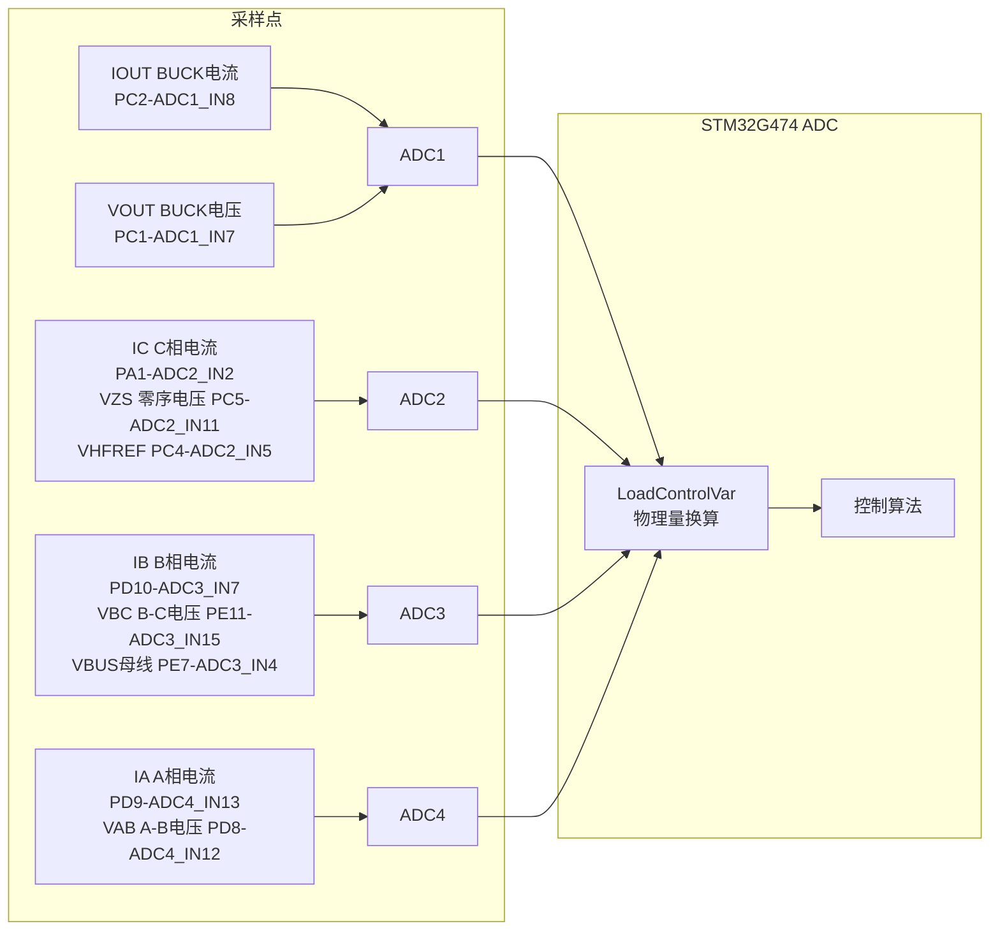
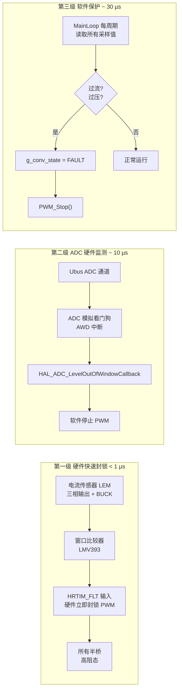

# 固件 — Firmware

> 本文件是固件模块的说明入口，详细内容待从主 README 拆分。

## 概述

基于 STM32G474VCT6 的嵌入式控制系统，运行于 Keil MDK 环境，使用 FreeRTOS (CMSIS-RTOS v2) 实时操作系统。

## 项目结构

```
Firmware_0/
├── APP/                  ← 应用层
│   ├── Applications/     ←   游戏、I2C 扫描、烧屏测试
│   ├── framework/        ←   电源管理、系统服务、RTC
│   ├── MiaoUI/           ←   UI 框架 (v1.2)
│   ├── PowerControl/     ←   电源控制核心 (ADC/PWM/PR/PI/保护)
│   ├── adc_handle.c
│   ├── beep.c/h
│   ├── button_handle.c
│   └── ui_task.c
├── BSP/                  ← 板级支持包
│   ├── Buttons/          ←   按键驱动
│   ├── OLED/             ←   OLED 底层驱动
│   └── u8g2/             ←   u8g2 图形库移植
├── Core/                 ← HAL 初始化、主循环、中断
├── Drivers/              ← STM32G4 HAL + CMSIS
├── MDK-ARM/              ← Keil MDK 工程文件
└── Middlewares/          ← 第三方库
```

## 关键模块

| 模块 | 路径 | 说明 |
|------|------|------|
| ADC 采样 | `APP/PowerControl/conv_adc.c/h` | HRTIM 触发同步采样，9 路 DMA |
| 控制算法 | `APP/PowerControl/algorithm_control.c/h` | PID、准 PR 控制器 |
| 环路控制 | `APP/PowerControl/conv_loop.c/h` | 双 PR 电流环、BUCK PI-P |
| PWM 驱动 | `APP/PowerControl/conv_pwm.c/h` | HRTIM 四单元、SVPWM |
| 保护系统 | `APP/PowerControl/conv_protection.c/h` | 三级保护 + 自动恢复 |
| 状态机 | `APP/PowerControl/conv_controller.c/h` | MainLoop + 状态切换 |
| UI 框架 | `APP/MiaoUI/` | 图标/列表菜单、40fps |
| 电源管理 | `APP/framework/` | 状态机、深度休眠、唤醒 |

---

## ④ 采样点确定与 ADC 分配

根据控制量需求，分配 ADC 通道与 HRTIM 触发时序：
- 采用 **4 个半桥并联** 的方案：三相整流器占用 3 个半桥（HRTIM A/B/C），BUCK 占用 1 个半桥（HRTIM D），共用同一组 HRTIM1 定时器资源，简化硬件布局

### ADC 通道映射



| 物理信号 | GPIO | ADCx_INx | DMA 索引 | 用途 |
|---------|:----:|:--------:|:--------:|------|
| $I_{L}$ — BUCK 电感电流 | PC2 | ADC1_IN8 | 0 | BUCK 电流内环反馈，由 ADC4 EOS 触发环路函数 |
| $V_{OUT}$ — BUCK 输出电压 | PC1 | ADC1_IN7 | 1 | BUCK 电压外环反馈 |
| $I_C$ — C 相电流 | PA1 | ADC2_IN2 | 0 | 三相电流 PR 环反馈 |
| $V_{ZS}$ — 零序电压 | PC5 | ADC2_IN11 | 1 | SVPWM 零序注入 / 三相平衡监测 |
| $V_{HFREF}$ — 半母线参考 | PC4 | ADC2_IN5 | 2 | 辅助参考 |
| $I_B$ — B 相电流 | PD10 | ADC3_IN7 | 0 | 三相电流 PR 环反馈 |
| $V_{BC}$ — B-C 线电压 | PE11 | ADC3_IN15 | 1 | 输入电压前馈 + 构造参考电流波形 |
| $V_{BUS}$ — 直流母线电压 | PE7 | ADC3_IN4 | 2 | 电压外环反馈 + 过压保护 |
| $I_A$ — A 相电流 | PD9 | ADC4_IN13 | 0 | 三相电流 PR 环反馈 |
| $V_{AB}$ — A-B 线电压 | PD8 | ADC4_IN12 | 1 | 输入电压前馈 + 构造参考电流波形 |

### HRTIM 触发链

各 ADC 由对应 HRTIM 定时器的比较事件硬件触发，实现全自动同步采样：

| ADC | HRTIM 定时器 | 触发事件 | HRTIM ADC Trigger | 说明 |
|:---:|:-----------:|---------|:-----------------:|------|
| ADC1 | Timer D (BUCK) | CMP3 | ADCTRIG_1 | BUCK 电流/电压采样，EOS ISR 调用 `MainLoop()` |
| ADC2 | Timer B (整流 B) | CMP3 | ADCTRIG_3 | IC、VZS、VHFREF 采样 |
| ADC3 | Timer C (整流 C) | CMP4 | ADCTRIG_5 | IB、VBC、VBUS 采样 |
| ADC4 | Timer A (整流 A) | CMP4 | ADCTRIG_4 | IA、VAB 采样 |

- **采样顺序**：ADC4（Timer A）→ ADC2（Timer B）→ ADC3（Timer C）→ ADC1（Timer D）随各自定时器时序依次触发
- **循环 DMA 模式**，缓冲区内数据自动更新无需 CPU 干预
- 使用 `LoadControlVar()` 在 ADC4 的 EOS 中断（或 HRTIM 中断）中完成原始值 → 物理量换算（斜率 + 零偏）

### 电压有效值与 PF 移相

- **有效值计算**：使用与 PF 移相**共用**的环形队列缓冲区（循环数组），对 $U_a, U_b$ 做递推滑动窗口 RMS。每采样一个新点 $x[k]$，压入队列同时弹出最旧值 $x[k-N]$：
  $$
  \Sigma \gets \Sigma + x^2[k] - x^2[k-N], \quad U_{rms} = \sqrt{\frac{\Sigma}{N}}
  $$
  队列深度 $N$ 可取半周波点数（如 166 点 @30 kHz / 50 Hz），RMS 更新仅需 1 次乘加和 1 次减法，计算量恒定。
- **归一化**：$U_{x\_norm} = U_x / U_{rms}$，得到幅值为 1 的单位正弦波。
- **PF 延迟**：同一环形队列的读取指针偏移即可实现移相，无需额外存储。
- **VREF**：使用 **REF3033** 提供精确 $3.300\,\text{V}$ 基准，ADC 参考电压硬编码为 $V_{ref+} = 3.3\,\text{V}$，无需 VREFINT 校准。

---

## ⑤ 控制策略设计

### 整体控制架构

```
                    ┌─────────────────────────────────────┐
                    │         电压外环 (PI)                 │
                    │  Ubus_ref ──→ PI ──→ Idc_ref        │
                    │  (母线电压→直流参考电流幅值)          │
                    └────────────────┬────────────────────┘
                                     │ Idc_ref (直流)
                                     ▼
                    ┌─────────────────────────────────────┐
                    │      参考电流波形合成                  │
                    │  ① 采样 Uab, Ubc → 重构 Ua, Ub, Uc  │
                    │  ② 有效值归一化: Ux_norm = Ux/Urms   │
                    │  ③ 合成参考电流(可选PF移相):          │
                    │  Iref_a = Idc_ref × Ua_norm          │
                    │  Iref_b = Idc_ref × Ub_norm          │
                    │  (Ic 由 -Ia - Ib 导出)               │
                    │                                      │
                    │  PF=1: 不移相  PF≠1: 数组延迟移相    │
                    └──────────────┬──────────────────────┘
                                     │ Iref_a, Iref_b (正弦)
                                     ▼
                    ┌─────────────────────────────────────┐
                    │     双 PR 电流内环 (A/B 相, 120°)     │
                    │                                      │
                    │  Iref_a ─→ [PR_a] ─→ Va_ref         │
                    │  Iref_b ─→ [PR_b] ─→ Vb_ref         │
                    │                                      │
                    │  C 相: Vc_ref = -Va_ref - Vb_ref     │
                    │  零序注入 → SVPWM/DPWM-A             │
                    │  → HRTIM A/B/C                       │
                    └─────────────────────────────────────┘

                    ┌─────────────────────────────────────┐
                    │        BUCK 控制                      │
                    │  Uo_ref ──→ PI电压环 ──→ Iref        │
                    │  Iref ──→ P电流环 ──→ Duty ──→ HRTIM D│
                    └─────────────────────────────────────┘
```

### 三相整流器控制——电压外环 + 参考电流 + 双 PR 电流内环

**核心思想**：不使用 $dq$ 旋转坐标系（无需 Park 变换 + 锁相环 PLL），而是在 **ABC 静止坐标系** 中使用 **双 PR（比例谐振）控制器** 直接控制 A、B 两相电流（二者天然相差 120°），C 相由 $-A-B$ 导出。

#### 1. 电压外环 (PI)

- 给定：`Ubus_ref`（直流母线电压目标值）
- 反馈：`Ubus`（ADC 采样）
- 输出：**`Idc_ref`** — 直流参考电流幅值（非正弦量），经限幅后送入参考电流合成
- 作用：母线电压误差经 PI 调节得到一个直流电流幅值 `Idc_ref`，它乘以单位化的输入电压波形即得到正弦参考电流的幅值。负载越重 → `Idc_ref` 越大 → 输入电流幅值越大。

#### 2. 参考电流波形合成（关键步骤）

这是将电压外环输出的 **直流 `Idc_ref`** 转换为 **正弦参考电流 `Iref_a, Iref_b`** 的核心环节：

```
Idc_ref (直流)                    Uab, Ubc (ADC 采样)
      │                                │
      │                                ▼
      │                    重构三相电压 Ua, Ub, Uc
      │                          │
      │                          ▼
      │                   有效值计算 Urms ← 滑动窗口 / 单周期
      │                          │
      │                          ▼
      │                    归一化 Ux_norm = Ux / Urms
      │                          │
      │                    ┌─────┴─────┐
      │                    │ PF=1?     │
      │                    ├──是──┬──否──┤
      │                    │      │      │
      │                    ▼      ▼      │
      │              不移相   数组延迟移相 │
      │                    │      │      │
      │                    └──┬───┘      │
      │                       ▼          │
      │              Ua_norm_delayed      │
      │              Ub_norm_delayed      │
      └───────────┬───────────┘
                  │
                  ▼
     Iref_a = Idc_ref × Ua_norm(或延迟后)
     Iref_b = Idc_ref × Ub_norm(或延迟后)
     Iref_c = -(Iref_a + Iref_b)  ← 导出
```

- **有效值计算**：对采样到的 $U_a, U_b$ 做滑动窗口 RMS 计算（如半周波或单周期窗口），用于归一化：
  $$
  U_{rms} = \sqrt{\frac{1}{N}\sum_{k=0}^{N-1} u^2[k]}
  $$
  归一化后的 $U_{x\_norm}$ 是幅值为 1 的单位正弦波，乘以 `Idc_ref` 即得到幅值正比于负载的正弦参考电流。

- **单位功率因数（PF = 1.0）**：`Idc_ref` 直接乘以未移相的单位化电压波形，参考电流与输入电压同相同形。

- **功率因数可调（PF ≠ 1.0）**：通过 **数组延迟** 实现对电压波形的移相。将采样到的 $U_{a\_norm}, U_{b\_norm}$ 存入循环缓冲区，读取时按设定的延迟点数偏移，等效于移相 $\phi$：
  $$
  \text{延迟点数} = \frac{\phi}{360°} \times \frac{f_{sw}}{f_{grid}}
  $$
  移相后的单位化电压波形再与 `Idc_ref` 相乘，即得到所需 PF 的正弦参考电流。

#### 3. 双 PR 电流内环（A/B 相, 120° 静止坐标系）

- 两个 PR 控制器分别控制 **A 相** 和 **B 相** 电流（二者相差 120°）
- C 相不设独立控制器，由 $V_{c\_ref} = -V_{a\_ref} - V_{b\_ref}$ 导出
- PR 传递函数（准 PR）：
  $$
  G_{PR}(s) = K_p + \frac{2K_r \omega_c s}{s^2 + 2\omega_c s + \omega_0^2}
  $$
- PR 在基波频率 $\omega_0 = 2\pi \times 50\,\text{Hz}$ 处增益极大，实现正弦无静差跟踪
- 准 PR（$\omega_c > 0$）增加带宽，对电网频率波动有鲁棒性
- PR 输出 $V_{a\_ref}, V_{b\_ref}$ 经零序注入后送入 SVPWM / DPWM

#### ⚠️ 控制器限幅与抗饱和（关键）

所有 PI/PR 控制器必须配备 **输出限幅** 和 **积分/谐振项抗饱和**，否则在开环调试或启动瞬间积分/谐振项会无限累积，导致环路崩溃：

| 控制器 | 限幅参数 | 抗饱和策略 | 限幅依据 |
|--------|---------|-----------|---------|
| 电压外环 PI | `Idc_ref` 限幅 $[0, I_{max}]$ | 积分分离：`Ubus` 偏差过大时冻结积分 | $I_{max}$ 由硬件电流传感器量程和功率管额定电流决定 |
| PR 电流内环 | `Va_ref` / `Vb_ref` 限幅 $[\pm V_{dc}/2]$ | **反计算抗饱和**（见 `algorithm_control.c` `PR_Control()`）：输出饱和时将限幅差值反算回误差项，避免谐振项无限累积，基于香港理工大学论文《用于逆变器的比例-谐振控制器的抗饱和方案》| 调制比上限 $\pm V_{dc}/2$ 对应 SVPWM 线性区边界 |
| BUCK 电压 PI | `Ibuck_ref` 限幅 $[0, I_{buck\_max}]$ | 积分分离 | $I_{buck\_max}$ 由 BUCK 电感饱和电流和输出电容决定 |
| BUCK 电流 P | `Duty` 限幅 $[D_{min}, D_{max}]$ | 纯比例无需饱和处理 | $D_{max}$ 由 HRTIM 死区和最小导通时间决定 |

限幅值需与硬件参数匹配，在 `conv_controller.h` 中通过宏定义集中配置，便于调试时调整。

#### 4. SVPWM / DPWM-A 调制

- 整流侧三相使用 **SVPWM** 调制（标准 7 段式），零序分量 min-max 注入
- **DPWM-A**（待实现）：不连续 PWM 变体，每相在 60° 区间内钳位到母线轨，此区间内该相不开关，可降低开关损耗约 1/3。根据电流相位实时切换钳位区间。

### BUCK 降压控制——PI 电压环 + P 电流环

- **电压外环 (PI)**：给定 36 V，反馈 $U_{buck}$，输出电流参考 $I_{buck\_ref}$
- **电流内环 (P)**：跟踪 $I_{buck\_ref}$，输出占空比
- 电流内环使用纯比例（P）控制即可，无需积分项
- BUCK 开关频率由 HRTIM D 独立配置，通常高于整流侧

### 保护系统设计

保护系统采用 **三级硬件+软件协同** 架构，确保任何故障都能在最短时间内响应：



| 层级 | 保护对象 | 传感器/检测 | 执行器 | 响应时间 | 动作 |
|:---:|---------|------------|--------|:-------:|------|
| **1 — 硬件快速封锁** | 三相电流、BUCK 电流 | 电流传感器（LEM/采样电阻）→ **外部窗口比较器** → HRTIM1 故障输入引脚 `FLT` | HRTIM 硬件 | **< 1 µs** | 立即将所有 PWM 输出置为高阻态（三态），不受软件干预 |
| **2 — ADC 看门狗** | 直流母线电压 $U_{bus}$ | ADC3 通道 → 配置 ADC 模拟看门狗（AWD），设置上下阈值 | ADC 中断回调 | **~ 10 µs** | 触发 `HAL_ADC_LevelOutOfWindowCallback()` → 软件置 `CONV_FAULT` → `PWM_Stop()` |
| **3 — 软件过流检测** | 全部 9 路采样 | `MainLoop()` 中每周期调用 `Protection()` 函数 | 软件状态机 | **~ 30 µs** | 比较各通道采样值与阈值 → 超限则 `g_conv_state = CONV_FAULT` → `PWM_Stop()` → 弹窗通知 + 自动恢复尝试 |

**保护阈值配置**（在 `conv_protection.h` 中定义）：

```c
#define PROT_OVERCURRENT_LIMIT    5.0f   // 过流阈值 (A)
#define PROT_OVERVOLTAGE_LIMIT    60.0f  // 过压阈值 (V)
#define PROT_AUTO_RETRY_ENABLE    1      // 是否启用自动恢复
#define PROT_AUTO_RETRY_DELAY_MS  2000   // 故障后等待重试时间 (ms)
#define PROT_AUTO_RETRY_MAX       3      // 最大重试次数
```

**自动恢复机制**：`AutoRecover_Task()` 以可配置延迟（默认 2 s）自动将 `g_conv_state` 从 `CONV_FAULT` 复位到 `CONV_STOP`，再由用户通过仪表盘重新启动。连续失败超过 `PROT_AUTO_RETRY_MAX` 次则永久闭锁，需硬件复位。

### 待实现的高级功能

| 功能 | 说明 |
|:----|------|
| **DPWM-A** | 不连续 PWM 变体，每相 60° 钳位到母线轨，降低开关损耗约 1/3；需根据电流相位实时切换钳位区间 |
| **自适应母线电压** | $V_{bus\_ref} = \max(V_{out},\ \sqrt{2} \cdot V_{in\_rms})$ — 取 BUCK 所需最低输入电压（$V_{out}$）与整流器 Boost 所需最低母线电压（$\sqrt{2}V_{in\_rms}$）中的较大者，在保证正常工作的前提下最小化母线电压以降低开关损耗 |
| **自适应死区** | 根据负载电流大小动态调整 HRTIM 死区时间：轻载小死区（减小波形失真），重载大死区（防止直通） |

---

## ⑥ 软件架构设计

- **三优先级架构**：
  - **HRTIM 重复中断（最高）**：开关频率 **30 kHz 固定**，执行 PR 电流环、BUCK 电流环、PWM 更新
  - **HRTIM 中慢速路径（中等）**：有效值计算、电压归一化、PF 移相（每若干开关周期执行一次）
  - **FreeRTOS 任务（最低）**：UI 显示、按键扫描、电源管理、系统统计
- **7 个 RTOS 任务**：见主 README [固件架构] 章节
- **保护分层**：
  1. **ADC 看门狗** — 硬件监测 $U_{bus}$，超阈值即触发中断
  2. **外部窗口比较器 + HRTIM_FLT** — 电流传感器输出接入窗口比较器，超限立即硬件封锁 HRTIM 所有 PWM 输出
  3. **软件过流检测** — `MainLoop()` 中每周期比较采样值，超限则软件停止 PWM

---

## 固件架构

### 软件分层

```
┌──────────────────────────────────────────────────────────┐
│                   应用层 (Applications)                    │
│  Dashboard · Burn-in Test · I2C Scanner · Snake · Dino   │
├──────────────────────────────────────────────────────────┤
│                   框架服务层 (Framework)                   │
│  电源管理 · 系统操作 · 系统统计 · RTC时间 · 蜂鸣器 · 通知 │
├──────────────────────────────────────────────────────────┤
│                   电源控制层 (PowerControl)                │
│  ADC采样 → 控制器(PR/PI/P) → 环路算法 → PWM驱动 → 保护   │
├──────────────────────────────────────────────────────────┤
│                   UI 框架层 (MiaoUI + u8g2)               │
│  图标菜单 · 列表菜单 · 动画引擎 · 显示驱动 · 输入驱动     │
├──────────────────────────────────────────────────────────┤
│                  BSP + HAL + CMSIS-RTOS 层                │
│  HRTIM · ADC1~4 · SPI · I2C · UART · RTC · COMP  │
└──────────────────────────────────────────────────────────┘
```

### FreeRTOS 任务

| 任务名 | 优先级 | 栈大小 | 功能 |
|--------|--------|--------|------|
| `powerdown_Task` | Realtime | 128 | 电源管理主状态机，休眠/唤醒控制 |
| `UI` | Low | 512 | OLED 显示与 MiaoUI 事件循环 (40 fps) |
| `Button` | High | 96 | 按键扫描与去抖 (10 ms) |
| `Beep` | Low | 64 | PWM 蜂鸣器驱动 |
| `Notification` | Normal | 128 | OLED 弹窗通知管理 |
| `AutoRecover` | Low | 64 | 故障自动恢复重试 |
| `Update` | Low | 256 | 系统参数采集（结温、电池电压、内部参考） |

### 实时控制路径

```
HRTIM 触发链 (开关频率 30 kHz)
    │
    ├── Timer A CMP4 ─→ ADCTRIG_4 ─→ ADC4  (IA, VAB)
    ├── Timer B CMP3 ─→ ADCTRIG_3 ─→ ADC2  (IC, VZS, VHFREF)
    ├── Timer C CMP4 ─→ ADCTRIG_5 ─→ ADC3  (IB, VBC, VBUS)
    └── Timer D CMP3 ─→ ADCTRIG_1 ─→ ADC1  (IOUT, VOUT)
                                          │
                                          └── EOS ISR
                                              │
                                              └── MainLoop()  [conv_controller.c]
                                                   │
                                                   ├── LoadControlVar() ← ADC DMA 缓冲  [conv_adc.c]
                                                   │    └── 10 路采样 → float 物理量
                                                   │
                                                   ├── [整流器慢速路径 — 非实时更新]
         │    ├── 有效值计算 (滑动窗口)
         │    ├── 单位化: Ux_norm = Ux / Urms
         │    └── (可选) PF 移相: 数组延迟电压波形
         │
         ├── [CONV_RUN 状态 — 实时路径 30 kHz]
         │    │
         │    ├── 整流器控制路径:
         │    │   ├── 电压外环 PI (Ubus_ref - Ubus) → Idc_ref
         │    │   ├── 参考电流合成:
         │    │   │   Iref_a = Idc_ref × Ua_norm(或延迟)
         │    │   │   Iref_b = Idc_ref × Ub_norm(或延迟)
         │    │   │   Iref_c = -Iref_a - Iref_b
         │    │   ├── PR_a(Iref_a - Ia) → Va_ref
         │    │   ├── PR_b(Iref_b - Ib) → Vb_ref
         │    │   ├── Vc_ref = -Va_ref - Vb_ref
         │    │   ├── 零序注入 (min-max)
         │    │   └── SVPWM / DPWM-A → SetDuty_Rec() → HRTIM A/B/C
         │    │
         │    ├── BUCK 控制路径:
         │    │   ├── PI 电压环 (Uo_ref - Ubuck) → Ibuck_ref
         │    │   ├── P 电流环 (Ibuck_ref - Ibuck) → Duty
         │    │   └── SetDuty_Buck() → HRTIM D
         │    │
         │    └── Protection() ← 过流/过压检测  [conv_protection.c]
         │
         └── 自适应算法 (慢速更新 loop):
              ├── 自适应母线电压: Vbus_ref = max(36V, √2·Vin_rms)
              ├── 自适应死区: 根据负载电流调整死区时间
              └── PF 移相延迟点数更新
```

### 任务间通信

- **3 个消息队列**：按键事件 (`Button_Queue`)、蜂鸣器指令 (`Beep_Queue`)、通知字符串 (`Notification_Queue`)
- **2 个互斥锁**：SPI 总线保护 (`mutex_gspi_`)、I2C 总线保护 (`mutex_i2c_`)

### 电源管理状态机

```
PM_STATE_RUN → PM_STATE_UI_OFF → PM_STATE_SLEEP_PREPARE
                                        │
                                        ▼
                                PM_STATE_DEEPSLEEP (STOP1)
                                        │
                                        ▼
                              PM_STATE_SLEEP_PENDING → PM_STATE_RUN
                                        │
                                        ▼
                                PM_STATE_STANDBY (STOP2)
```

- 空闲超时自动关闭显示 → 深度休眠 → 按键唤醒
- 唤醒后 ~100 ms 不响应按键（防抖静默期）

### UI 菜单树

```
[主页面] (图标菜单)
 ├── DashBoard           ← 电源仪表盘（电压/电流/功率/母线/启停控制）
 ├── [设置] (图标菜单)
 │    ├── 电源设置        ← 整流开关频率、BUCK 开关频率、母线参考电压
 │    ├── 保护设置        ← 过流阈值、VBUS 过压阈值
 │    ├── 显示设置        ← 对比度、翻转、休眠时间
 │    ├── 休眠设置
 │    ├── 时间设置        ← RTC 时间调整
 │    └── 系统设置        ← 按键音、静音、通知时间、系统复位
 ├── [统计] (列表)
 │    ├── CPU 温度        ← 内部温度传感器
 │    ├── 电池电压
 │    └── 内部参考电压
 ├── [工具] (图标菜单)
 │    ├── 烧屏测试
 │    └── I2C 扫描器
 ├── [游戏] (图标菜单)
 │    ├── 贪吃蛇
 │    └── 小恐龙
 └── 关于
```
